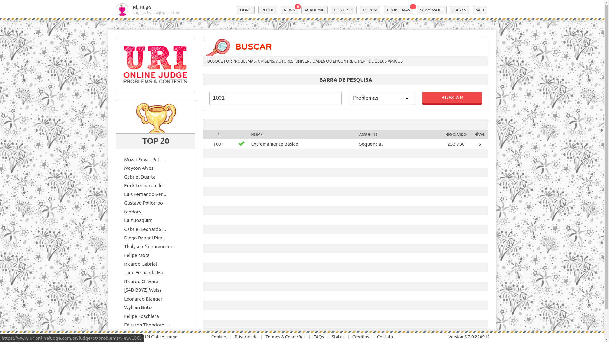
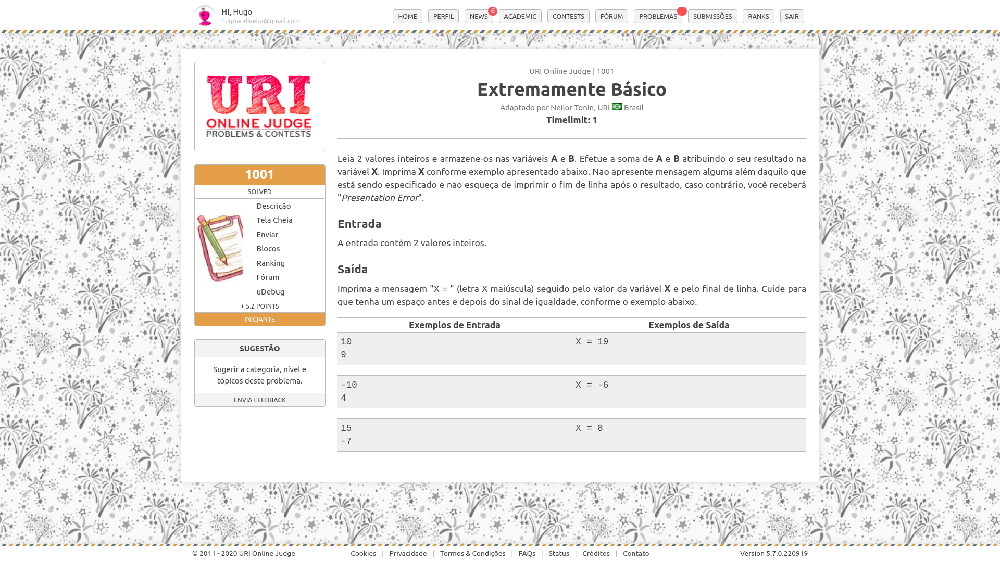
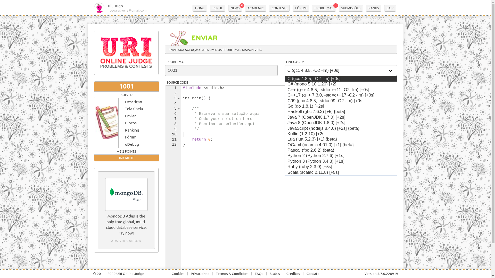
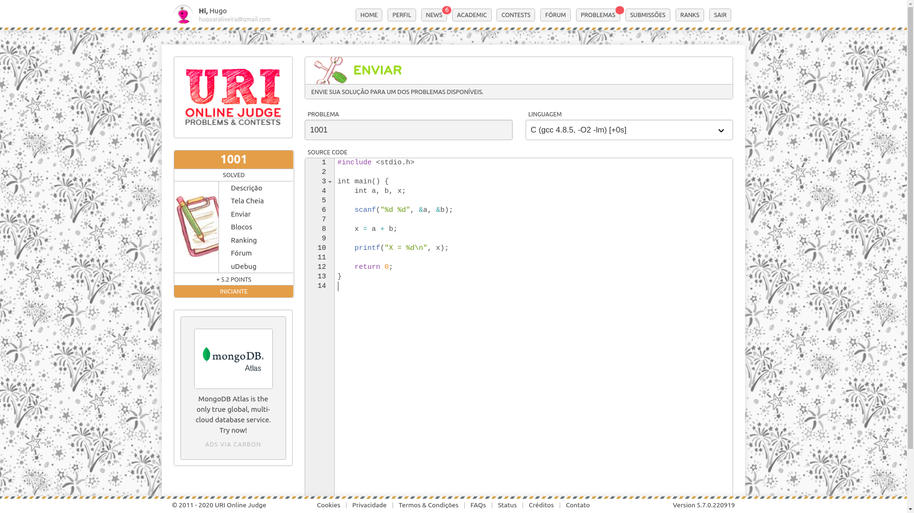
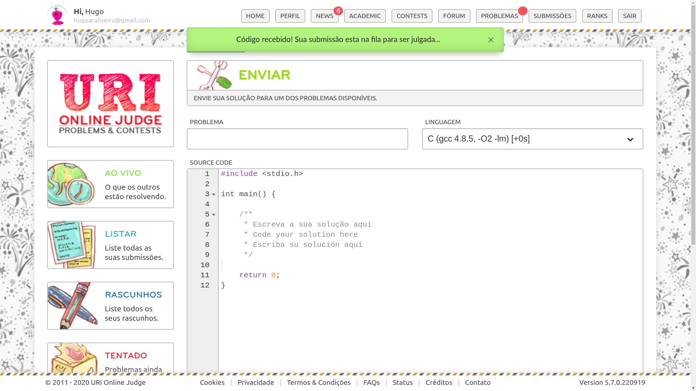
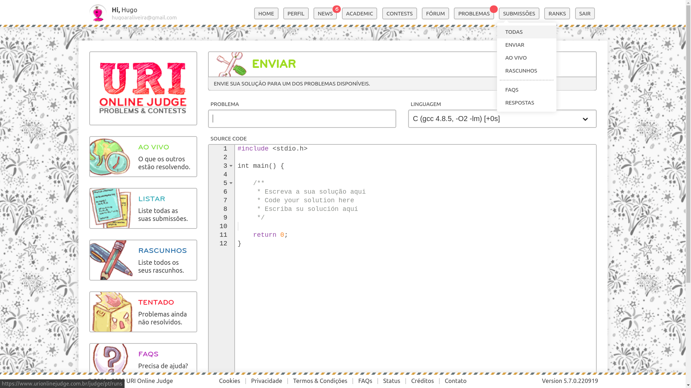
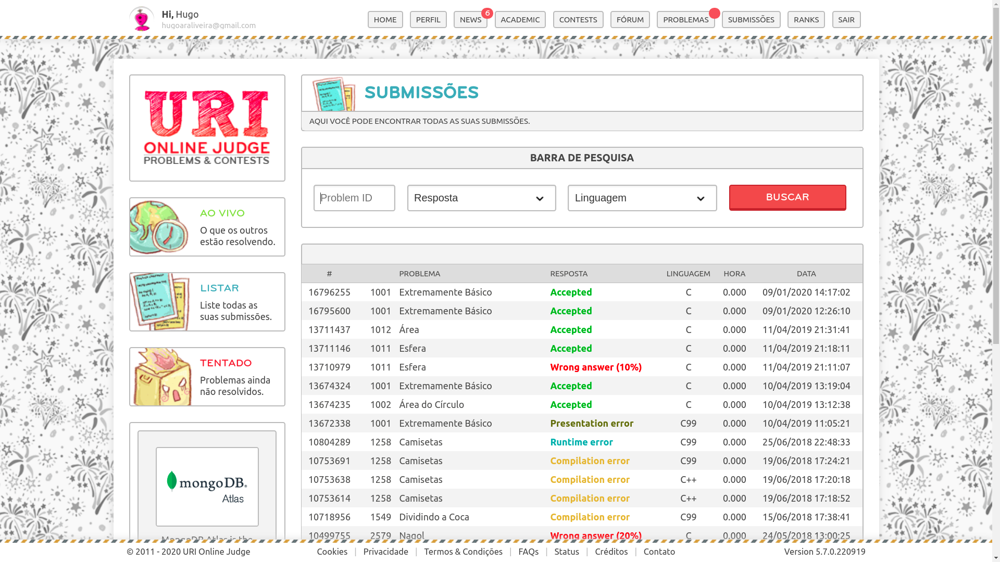

# Codigos em Linguagem C
Este repositório contém exercicios resolvidos na linguagem C, contidos no julgador online [Uri Online Judge](https://www.urionlinejudge.com.br/judge/pt/login).

## URI Online Judge
O Uri é um site que contém exercícios de programação, onde o usuário pode
submeter seu código para correção, o próprio site conta com um software
que corrige seu código automaticamente.

Um breve tutorial:

Acesse o site e crie uma conta.

Ao entrar, você encontrará a página principal, onde consta um espaço para busca de exercícios. Digite o código do problema e selecione 'Problemas' na caixa de seleção, usaremos o exercício 1001 como exemplo. Clique em buscar.

Ao encontrar o exercício o URI disponibiliza algumas informações sobre o status do problema. Para acessá-lo basta clicar no nome do mesmo.

Agora basta ler o problema e resolvê-lo usando seu editor de texto preferido. Lembre-se de seguir corretamete as intruções, pois uma simples quebra de linha pode gerar erro, uma boa prática é sempre testar o código antes de enviar, pois o julgador compara a saída com o valor e formato da saída de dados.

Depois de testar seu código em sua máquina, selecione a linguagem em que o código foi escrito (no nosso caso C).

Copie e cole seu código e clique em enviar.

Ao enviar, uma mensagem de confirmação aparecerá no topo da tela.

Para conferir o status do seu envio e se sua resposta está correta, basta ir no menu superior na aba submissões e clicar em 

Na tela parecerá a lista de todos seus exercícios resolvidos e o status do mesmo, contando com: porcentagem de acerto. tipo de erro, tentativas e etc.

Sinta-se livre para explorar o site, complete as informações do seu perfil,
lá é possível selecionar sua linguagem preferida, isso evita que você tenha que selecionar a linguagem correta sempre que for submeter um exercício.

## Como contribuir
Para contribuir com o repositório, seu codigo precisa obedecer algumas regras simples:          
* Utilizar os nomes das variáveis de acordo com o que o exercício do Uri pede ou da forma mais explícita possível    
* O nome do arquivo deve obedecer a seguinte sintaxe: uri\<numerodoexercicio\>.c
* Obrigatoriamente o exercício deve ser aceito na plataforma Uri com 100% de acerto.
* Se é sua primeira vez, será interessante abrir algum dos códigos como exemplo.

## Sobre e contato
Olá :)

Me chamo Hugo Aragão, sou aluno de Engenharia de Software na Universidade de Brasília (UnB), criei esse e outros repositórios afim de compartilhar meus conhecimentos em sofware com outros alunos.

Este em específico foi construído com o objetivo de auxiliar estudantes da Linguagem C, que estão começando e ainda se sentem 'perdidos' na lógica de programação.

O contato pode ser feito por e-mail no endereco: hugoaraliveira@gmail.com, com o assunto [Repositório C] sem os colchetes.

Bons Estudos!